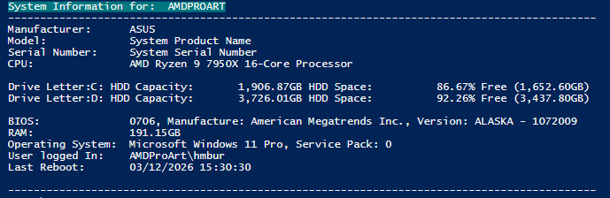

# DailyTasks Toolkit


Practical scripts for common day-to-day admin, diagnostics, and maintenance tasks.

## What Is Inside

| Script | Purpose |
| --- | --- |
| `ComputerInfoHTML.ps1` | Generates computer information in HTML format. |
| `IterationFiles.ps1` | Iterates through files/folders for batch operations. |
| `Office2024_UpdatesActivate.ps1` | Handles Office 2024 update/activation workflow. |
| `OutlookRemoval.ps1` | Removes Outlook components/configuration. |
| `PingMachine.ps1` | Checks host reachability with ping. |
| `PWGenerator.py` | Creates random passwords. |
| `SystemInfo.ps1` | Collects and displays detailed system information. |
| `WSUSCleanUp.ps1` | Performs WSUS cleanup tasks. |
| `InstalledApplications.ps1` | Software Inventory Report. |  

## Script Highlights

### 🖥️ `SystemInfo.ps1`

Collects key system details useful for troubleshooting and inventory checks.

#### Preview (JPG)



> Tip: Put your JPG screenshot at `Images/SystemInfo.jpg` so it renders here.

### 🌐 `PingMachine.ps1`

Quick connectivity check for a target machine.

#### Preview (JPG)


> Tip: Put your JPG screenshot at `Images/PingMachine.jpg` so it renders here.

### 🔐 `PWGenerator.py`

Generates random passwords for daily admin use.

### 🧹 `WSUSCleanUp.ps1`

Helps keep WSUS healthy by cleaning obsolete update data.

### 🖥️ `InstalledApplications.ps1`

Collects key application details useful for appslication inventory checks.

## Quick Start

### Run a PowerShell script

```powershell
powershell -ExecutionPolicy Bypass -File .\SystemInfo.ps1
```

### Run the Python password generator

```powershell
python .\PWGenerator.py
```

## Notes

- Run scripts in an elevated PowerShell session when required.
- Review script contents before running in production environments.
